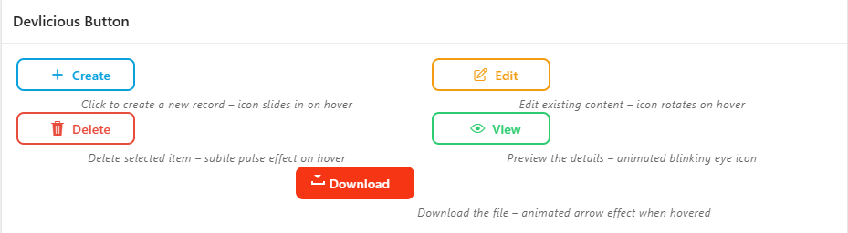

# devlicious-buttons
A curated collection of clean and stylish HTML/CSS buttons designed for Oracle APEX, forms, and modern web pages — built with focus on interactivity and elegant UI.

## How to Use
### Step 1 – Include the CSS file
Import the CSS file into your Oracle APEX app:
→ Either via Shared Components > CSS,
or inside the inline CSS section of a specific page.

### Step 2 – Add the Button HTML
Create a button template using the provided HTML structure.
You can copy the code snippet of any button you like from this repo.

### Step 3 – Use the Button in Your Page
Go to your page
Create a new button
Under the "Appearance" section, select your new custom button template
Save and run the page

That's it! You now have modern, animated, and responsive buttons in your APEX app.

